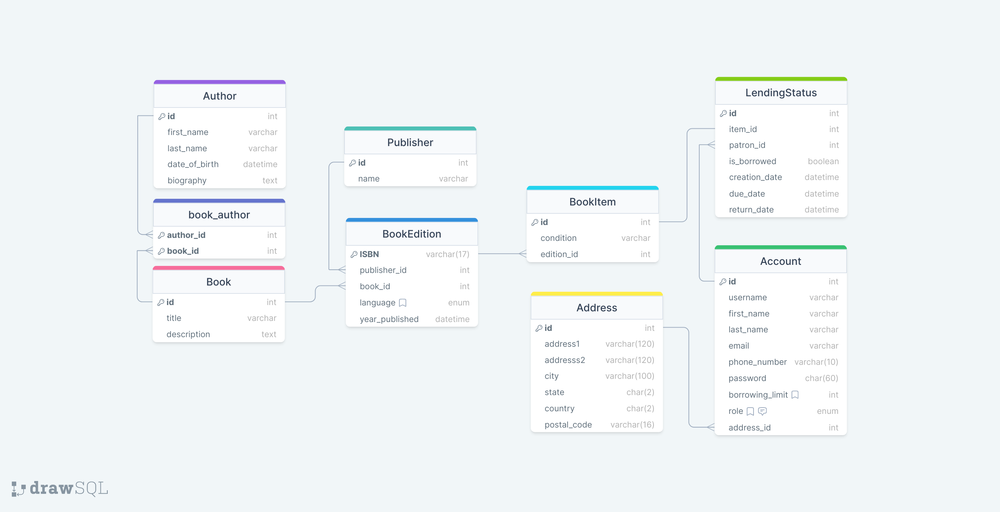

# Library Management System 
(problem 1 for the Siemens internship challange)

## Scenario:
  You are tasked with designing a library management system for a university. The system should allow
librarians to manage books, patrons, and borrowing activities efficiently.

## Requirements:
###  Book Management:
* Books have attributes like Title, Author, ISBN, and Quantity.
* Patrons can borrow multiple books.
* A book can be borrowed by multiple patrons.
###  Patron Management:
* Patrons have attributes like Name, ID, and Contact Information.
* Each patron can borrow a limited number of books at a time.
* Patrons can have fines if books are returned late.
###  Borrowing System:
* Books can be borrowed for a specific duration.
* Calculate fines for late returns based on a predefined fine rate.

## Tasks:
###  Class Diagram:
  Create a class diagram showing the relationship between Book, Patron, and Borrowing.
Include relevant attributes and relationships between classes.
###  Database Diagram:
  Design a database schema representing the entities Book, Patron, and Borrowing.
Define the relationships between tables and attributes.

(<a href="#readme-top">back to top</a>)

# Problem Solving

In this section, I'll detail the problem-solving process for designing the Library Management System. I'll cover the key tasks outlined in the problem statement, providing diagrams and commentary to illustrate my approach.

## Database Schema Design

### Task 1: Database Schema

#### Conceptual Model 
I considered the following:
> - One book can have multiple authors
> - One author can have multiple books

> - One book can have multiple editions/variations
> - A book edition has a publisher
> - A book edition has multiple copies/prints/items

> - One book copy can have a lendig status that holds information like if its borrowed, when it was, the due & return date

> - One account (librarian or patron) can borrow multiple books
> - Multiple accounts can borrow the same book from one edition (unique book copies for each patron)
> - One account has a single role of Librarian OR Patron
> - One account has a adress and contact information

#### Commentary:

**The `Author` table** stores information about authors, including their first name, last name, date of birth, and biography. The `id` column acts as a unique identifier, and the table establishes a clean many-to-many relationship with the `Book` table through the `BookAuthor` junction table.

**The `Book` table** represents central information about books in the library. It includes essential details such as the title and description. The `id` column serves as the primary key, uniquely identifying each book. The relationship with the `Author` table is established through the `book_author` junction table, enabling the representation of multiple authors for a single book.

**The `BookEdition` table** represents different editions/variants of a book. Each edition is identified by a unique ISBN, and the table includes information such as the publisher, language, and year of publication. The `BookEdition` table establishes a foreign key relationship with both the `Book` and `Publisher` tables, connecting editions to specific books and their respective publishers.

**The `BookItem` table** represents physical copies of books available in the library. Each item is uniquely identified by the `id` column, and its condition is recorded. The `edition_id` foreign key links each item to a specific edition in the `BookEdition` table. This table is crucial for tracking the availability and condition of individual copies.

**The `LendingStatus` table** captures the status of book borrowings. It includes details such as the creation date, due date, and return date. The `is_borrowed` column indicates whether a book item is currently borrowed. The foreign key relationships with the `Account` and `BookItem` tables enable tracking the borrowing activities of individual patrons and the associated book items.

**The `Account` table** represents patrons and librarians in the system. It includes information such as username, name, contact details, and borrowing limits. The `role` column distinguishes between patrons and librarians. The `address_id` foreign key links each account to a specific address in the `Address` table.

## Class Diagram Design

